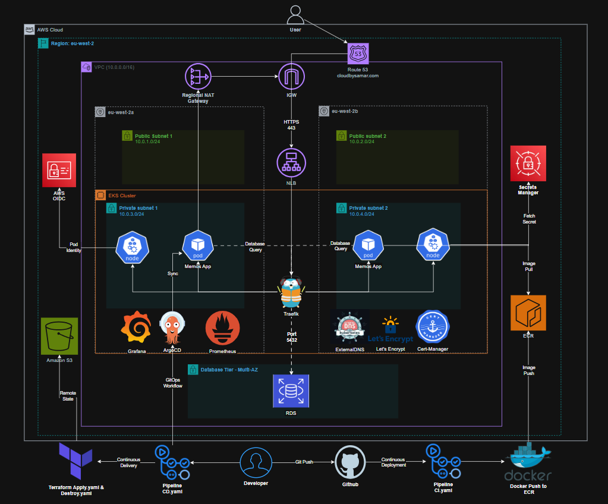
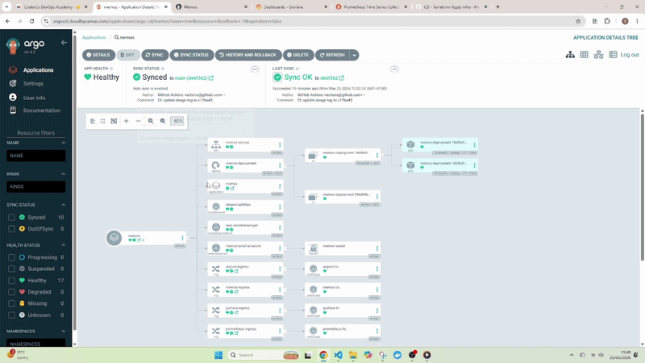
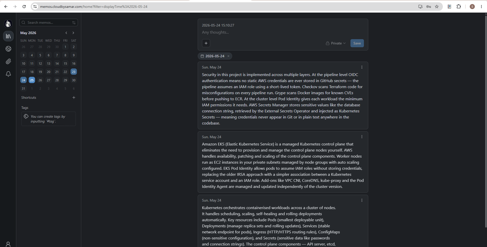
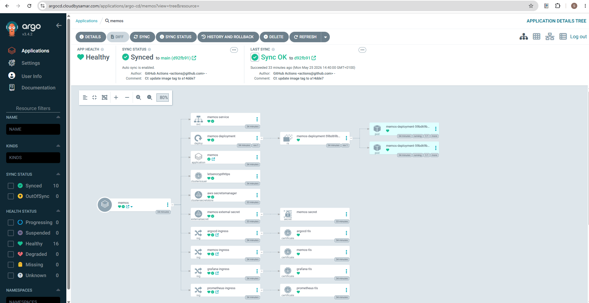
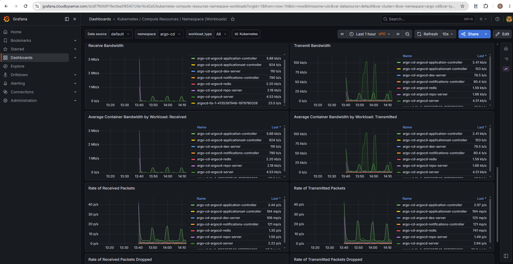
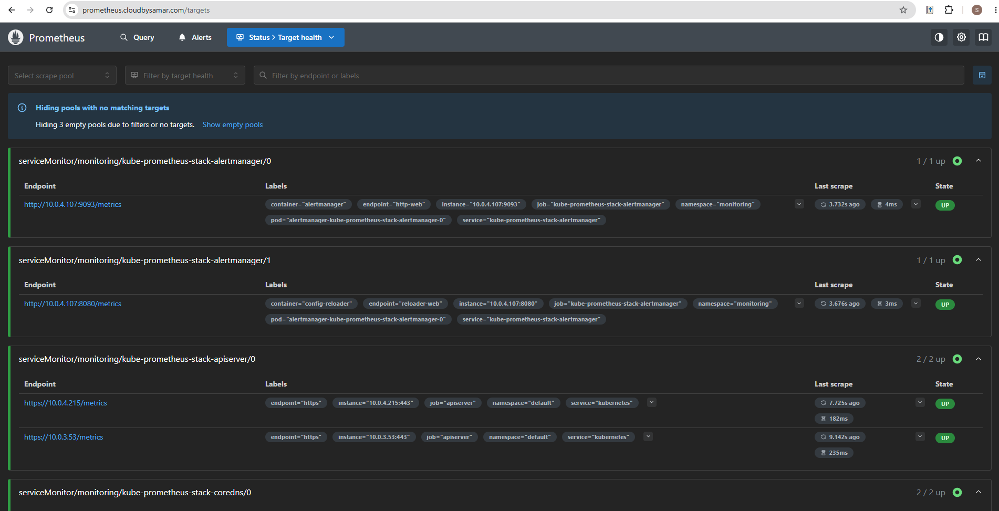
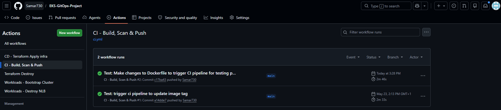

# EKS GitOps Platform | Production-Grade Kubernetes on AWS


A production-grade Kubernetes platform deployed on AWS EKS, provisioned with Terraform and managed through a GitOps workflow using ArgoCD. The platform hosts a self-hosted Memos note-taking application with automated CI/CD pipelines, full observability stack and zero static credentials.

## Architecture


## Overview

This project deploys a self-hosted [Memos](https://github.com/usememos/memos) note-taking application on a production-grade AWS EKS cluster. Infrastructure is fully provisioned using Terraform across two availability zones for high availability. The platform follows a GitOps model where ArgoCD continuously reconciles the cluster state against the Git repository. All cluster tooling is managed via Helmfile, CI/CD is handled through GitHub Actions with OIDC authentication and zero static credentials, and TLS certificates are automatically issued and renewed by CertManager via Let's Encrypt.

## Live Demo


## Prerequisites

- AWS Account with appropriate permissions
- Terraform >= 1.10
- AWS CLI configured
- kubectl installed
- Helm >= 3.17.0
- Helmfile installed
- Docker installed
- GitHub repository with the following secrets configured:
  - `AWS_ROLE_TO_ASSUME`: IAM role ARN for GitHub Actions OIDC authentication
  - `IAM_USER_ARN`: IAM user ARN for EKS cluster access

### AWS Secrets Manager

The following secrets must be created in AWS Secrets Manager before running the pipelines:

- `memos-db-password`: RDS database password
- `memos-db-username`: RDS database username
- `memos-dsn`: Full PostgreSQL connection string
- `admin-iam-arn`: IAM user ARN for EKS cluster admin access

## Project Structure

```
.
├── docs/
├── helm/
│   ├── values/
│   │   ├── argo-cd-values.yaml
│   │   ├── cert-manager-values.yaml
│   │   ├── externaldns-values.yaml
│   │   ├── externalsecrets-values.yaml
│   │   ├── prometheus-values.yaml
│   │   └── traefik-values.yaml
│   └── helmfile.yaml
├── k8s/
│   ├── argo-cd/
│   │   └── application.yaml
│   ├── cert-manager/
│   │   └── cluster-issuer.yaml
│   ├── external-secrets/
│   │   ├── cluster-secret-store.yaml
│   │   └── external-secret.yaml
│   └── ingress/
│       ├── argocd-ingress.yaml
│       ├── grafana-ingress.yaml
│       └── prometheus-ingress.yaml
├── terraform/
│   ├── bootstrap/
│   └── modules/
│       ├── eks/
│       ├── pod-identity/
│       ├── rds/
│       ├── sg/
│       └── vpc/
├── Dockerfile
└── README.md
```

## Tech Stack

**Infrastructure & Cloud**
- AWS: VPC, EKS, RDS, ECR, Route53, Secrets Manager, S3, IAM
- Terraform: Modular IaC (5 modules: vpc, eks, rds, sg, pod-identity)

**Cluster Tooling**
- ArgoCD: GitOps continuous delivery
- Helm + Helmfile: Declarative cluster tool management
- Traefik: Ingress controller
- ExternalDNS: Automated Route53 DNS management
- CertManager: Automated TLS via Let's Encrypt
- ESO: External Secrets Operator

**Monitoring**
- Prometheus + Grafana

**CI/CD & Security**
- GitHub Actions with OIDC authentication
- Grype for container image scanning
- Checkov for IaC scanning

**Application**
- Memos (self-hosted note-taking app)
- Docker

## Architecture Overview

- Multi-AZ AWS VPC with public and private subnets across eu-west-2a and eu-west-2b
- Public subnets host the Internet Gateway, Regional NAT Gateway and Network Load Balancer
- Private subnets host the EKS worker nodes, application pods and cluster tooling
- RDS PostgreSQL sits in a dedicated database tier within the private subnets
- Traffic flows from Route53 to the NLB over HTTPS 443, forwarded to Traefik inside the cluster
- Traefik routes requests to the Memos pods running on the worker nodes
- ExternalDNS automatically creates and updates Route53 DNS records when Ingress resources are applied
- CertManager issues and renews TLS certificates from Let's Encrypt via HTTP01 challenge
- ESO retrieves the database connection string from AWS Secrets Manager and injects it as a Kubernetes Secret
- Pod Identity associates IAM roles with Kubernetes service accounts, allowing pods to authenticate with AWS services without static credentials

## Terraform

Infrastructure is provisioned using modular Terraform across 5 reusable modules:

- **vpc**: Multi-AZ VPC with public and private subnets, Internet Gateway, Regional NAT Gateway and route tables
- **eks**: EKS cluster with managed node groups, cluster add-ons (VPC CNI, CoreDNS, kube-proxy, Pod Identity Agent) and IAM access entries
- **rds**: PostgreSQL RDS instance in private subnets with a dedicated subnet group
- **sg**: Security groups controlling traffic between the NLB, nodes, pods and RDS
- **pod-identity**: IAM roles and Pod Identity associations for ExternalDNS and ESO

A separate `bootstrap` directory provisions the foundational resources that must exist before the main infrastructure:

- S3 bucket for Terraform remote state with native locking
- ECR repository for Docker images
- OIDC provider and IAM role for GitHub Actions authentication

## Docker

The Dockerfile uses a 3-stage multi-stage build separating frontend compilation, backend compilation and the runtime, with the final image containing only the compiled binary on Alpine 3.21.

- Final image size reduced by 93% compared to a single-stage build
- Non-root user `appuser` with no interactive password limiting blast radius
- Images tagged with commit SHA ensuring every deployment is traceable
- Stored in ECR with immutable tags preventing accidental overwrites
- Grype scans the final image for HIGH and CRITICAL CVEs before pushing to ECR

## Helm + Helmfile

All cluster tooling is managed declaratively using Helmfile, allowing the entire cluster tool stack to be installed or upgraded with a single command. Each tool has its own values file under `helm/values/` for configuration. The following releases are managed:

- Traefik (ingress controller)
- ExternalDNS (Route53 DNS management)
- CertManager (TLS certificate automation)
- ArgoCD (GitOps controller)
- kube-prometheus-stack (Prometheus + Grafana)
- External Secrets Operator (AWS Secrets Manager integration)

## Kubernetes

The `k8s/` directory contains all manifests managed by ArgoCD:

- Deployment and Service for the Memos application
- Ingress resources for all four subdomains
- ClusterIssuer for Let's Encrypt TLS certificate issuance
- ClusterSecretStore and ExternalSecret for ESO integration with AWS Secrets Manager
- ArgoCD Application manifest pointing ArgoCD at the Git repository

## CI/CD Pipelines

Five GitHub Actions pipelines handle the full infrastructure and application lifecycle:

- `ci.yml`: Triggered on push to main —> builds the Docker image, runs Grype vulnerability scan, pushes to ECR and updates the deployment manifest with the new commit SHA
- `cd.yml`: Manual trigger —> runs Checkov IaC scan, Terraform plan or apply to provision infrastructure
- `workloads.yml`: Manual trigger —> connects to the cluster, runs Helmfile apply, creates the memos namespace and applies the ArgoCD Application manifest
- `workloads-destroy.yml`: Manual trigger —> deletes the NLB before infrastructure destruction
- `tf-destroy.yml`: Manual trigger —> runs Terraform destroy to tear down all infrastructure

All pipelines authenticate with AWS using OIDC, no static credentials are stored anywhere.

## GitOps with ArgoCD

ArgoCD is deployed into the cluster via Helmfile and configured to watch the Git repository. When the CI pipeline commits an updated image tag to `k8s/app/deployment.yaml`, ArgoCD detects the change within 3 minutes and triggers a rolling deployment to the cluster. Any drift between the cluster state and the Git state is automatically corrected, ensuring the cluster always reflects what is defined in the repository.

## Screenshots

### Memos Application


The Memos application running at memos.cloudbysamar.com, connected to RDS PostgreSQL via a database connection string retrieved automatically from AWS Secrets Manager by the External Secrets Operator.

### ArgoCD


ArgoCD showing the memos application Synced and Healthy with 16 resources under management. The last sync was triggered automatically by the CI pipeline committing an updated image tag to the deployment manifest, demonstrating the full GitOps loop from code push to live deployment.

### Grafana


Grafana displaying live cluster metrics from the kube-prometheus-stack, showing network bandwidth and packet rates across all namespaces.

### Prometheus


Prometheus target health page showing all scrape targets UP and being scraped successfully across the cluster.

### CI Pipeline


The CI pipeline running successfully, building the Docker image, scanning with Grype and pushing to ECR before updating the deployment manifest with the new commit SHA.

## How to Deploy

**1. Bootstrap**

Sets up the remote state backend, ECR repository and OIDC authentication:
cd terraform/bootstrap
terraform init
terraform apply

**2. Configure GitHub Secrets**

Add the following secrets to your GitHub repository:

- `AWS_ROLE_TO_ASSUME`: IAM role ARN output from bootstrap
- `IAM_USER_ARN`: Your AWS IAM user ARN for EKS cluster access

**3. Create AWS Secrets Manager Secrets**

```
aws secretsmanager create-secret \
  --name memos-db-password \
  --secret-string 'yourpassword' \
  --region eu-west-2

aws secretsmanager create-secret \
  --name memos-db-username \
  --secret-string 'memos' \
  --region eu-west-2

aws secretsmanager create-secret \
  --name memos-dsn \
  --secret-string 'postgresql://memos:yourpassword@<rds-endpoint>:5432/memos?sslmode=require' \
  --region eu-west-2

aws secretsmanager create-secret \
  --name admin-iam-arn \
  --secret-string 'arn:aws:iam::<account-id>:user/<username>' \
  --region eu-west-2
```

**4. Provision Infrastructure**

Trigger `cd.yml` manually via GitHub Actions and select `apply`.

**5. Bootstrap the Cluster**

Trigger `workloads.yml` manually via GitHub Actions.

**6. Access the Cluster Locally**
aws eks update-kubeconfig --region eu-west-2 --name eks-memos-cluster

**7. Tear Down**

Trigger `workloads-destroy.yml` first to delete the NLB, then trigger `tf-destroy.yml` to destroy all infrastructure.

## Lessons Learned

**EKS Access via OIDC Pipelines**

- When the EKS cluster is provisioned through a GitHub Actions OIDC pipeline, only the pipeline IAM role gets cluster access by default — not your local IAM user
- Fixed by adding `aws_eks_access_entry` and `aws_eks_access_policy_association` to the EKS Terraform module so the local user is granted access automatically on every provision

**Helm and Helmfile in CI**

- Helmfile requires a pinned version in CI as the latest download URL is unreliable
- Helm 4 is not compatible with Helmfile — pinning Helm to 3.17.0 resolved the issue
- The helm-diff plugin must also be pinned to avoid compatibility errors

**Certificate Issuance**

- CertManager HTTP01 challenges only succeed after ExternalDNS has created the Route53 DNS records
- Understanding this dependency order was key to debugging certificate failures during fresh cluster provisioning

**Terraform State Locking**

- Interrupting a pipeline mid-run leaves a state lock on the S3 backend requiring a manual `terraform force-unlock` before the next run

## Future Improvements

**Blue/Green Deployments**

Implement blue/green deployment strategy using ArgoCD Rollouts to eliminate downtime during releases and enable instant rollback by switching traffic between two identical environments.

**Multi-Environment Setup**

Introduce separate dev and production environments with different cluster configurations, resource limits and scaling policies. Dev environment would use minimal node sizes and single AZ to reduce costs.

**Cost Optimisation**

Replace the Regional NAT Gateway with VPC endpoints for AWS services (ECR, S3, Secrets Manager) to eliminate NAT Gateway data processing charges for internal AWS traffic.

**Enhanced Security**

Add AWS WAF in front of the NLB to protect against common web exploits and DDoS attacks. Implement network policies to restrict pod-to-pod communication to only what is required. Add OPA/Gatekeeper for policy enforcement at the Kubernetes admission level.

**Alerting**

Configure Alertmanager with notification channels (Slack or PagerDuty) to alert on critical cluster events such as pod crashes, node pressure and certificate expiry.

**Autoscaling**

Implement Cluster Autoscaler or Karpenter for node-level autoscaling and Horizontal Pod Autoscaler for pod-level scaling based on CPU and memory metrics.